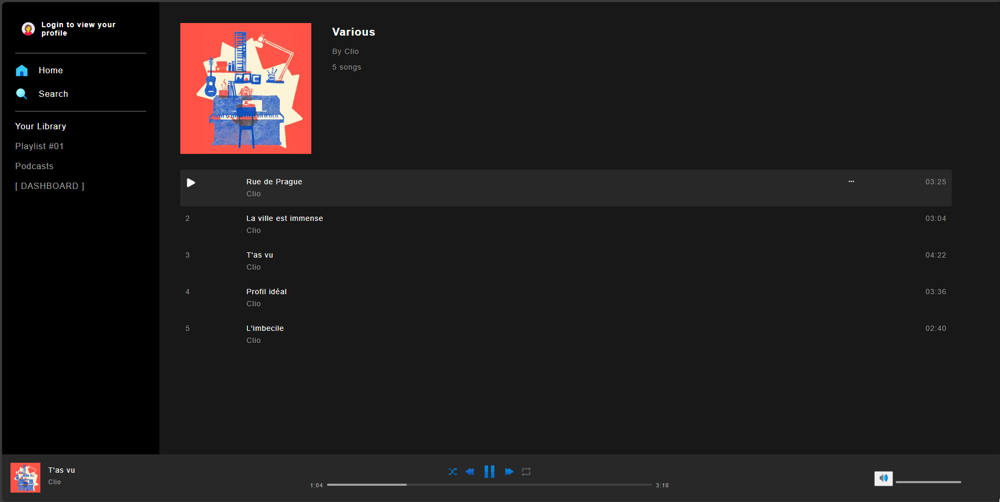
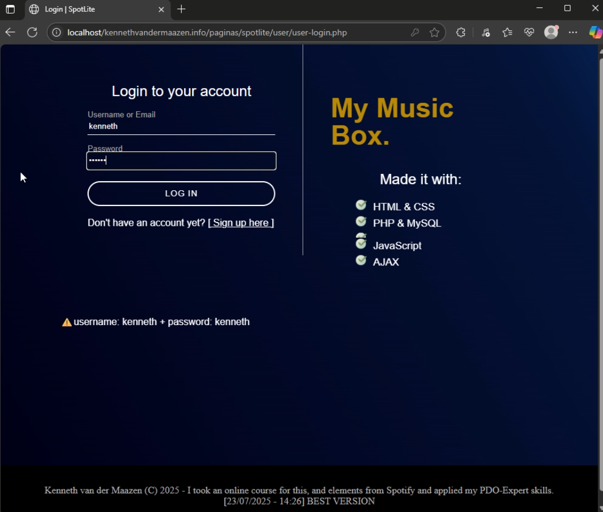

SpotLite <> Spotify clone  
Kenneth van der Maazen - 2025  
  
Voor in de digitale portofolio  
Moet wat grotere projecten erbij doen.  
  
===================================================  
  
Een spotif clone voor in je browser.  
  
  
  
  
  
  
TO-DO:   
- User music uploads  
- Admin dashboard   
- User profile dashboard   
- Sidebar active state   
- Spotify API integration   
- Muziek begint gelijk te spelen   
    
- admin moet muziek kunnen toevoegen vanuit user-dashboard   
- admin moet muziek kunnen verwijderen vanuit user-dashboard   
- admin moet ook banners met announcements kunnen uploaden   
- in database: playlist table aanmaken   
<!-- - als er geen gebruiker is ingelogd moet de index doorverwijzen naar login. -->  
- user-dashboard: fixed header maken bij het scrollen   
   
- user moet playlist kunnen maken  
- user moet playlist kunnen toevoegen aan playlist  
- user moet playlist kunnen verwijderen uit playlist  
- user moet playlist kunnen updaten  
  
- artists moeten ook een profielfoto kunnen uploaden  
  
- toetsenbord knoppen functionaliteit: [PLAY] - [PAUSE] - [NEXT] - [TERUG]  
  
- styling voor mobiele apparaten toevoegen  
  
  
  
- database table: album   
    + releaseDatum  
  
- database table: songs  
    + fueteringArtiest  
  
- database type? Album? Song? Playlist?  
  
OPTIONEEL:  
- user kan liedjes liken -> komen in favorieten  
- in browser tablad -> 🚸 [ALBUMNAAM] - [ARTIEST]  
  
========================================================  
Bestandsindeling:  
- /music [folder]  
    \ .mp3 [liedje]  
    \ .mp3 [liedje]  
    \ .mp3 [liedje]  
    \ .mp3 [liedje]  
    ...  
  
- images/artwork [folder]  
    \ .png [afbeelding]  
  
- images/artists-pic [folder]  
    \ .png [afbeelding]  
  
  
=======================================  
SIDEBAR  
🙆‍♂️ USERNAME  
   -viewprofile  
  
____________________  
YourLibrary     ➕  
  
✴️ PLAYLISTS_1  
playlist-username  
  
🆒 ALBUM  
album-artist  
  
  
========================================================  
ARTIEST PAGINA  
  
- artiest pagina  
        [ HEADER IMG ]  
  
        [ POPULAR ]  
            - 5 meest afgespeelde nummers  
  
        [ DISCOGRAPHY ]  
            [ALBUM]     [ALBUM]     [ALBUM]     [...]       +  
  
        [ ABOUT ]  
            - bio  
  
  
===========================================================  
ALBUM PAGINA  
[ HEADER ] = VASTE KLEUR  
[ ARTWORK ] + albumNAAM  _naam * releaseJaar * aantalNummers, totaleDuur   
  
▶️ [ALBUMNAAM] 🔀 🟦 ℹ️  
        #   Title           Plays           🕕  
-------------------------------------------------------------------------  
        1   liedje          4562            02:41  
        2   liedje          4562            02:41  
        3   liedje          4562            02:41  
        4   liedje          4562            02:41  
        5   liedje          4562            02:41  
        6   liedje          4562            02:41  
        7   liedje          4562            02:41  
  
29 March 2011  
©️ 2011 Atlantic  
  
  
  
Als user ingelogd is, profielfoto tonen rechts in navBar  
  
=======================  
  
  
  
!! de locatie van javascript bestand wordt toegewezen in de header.php !!  